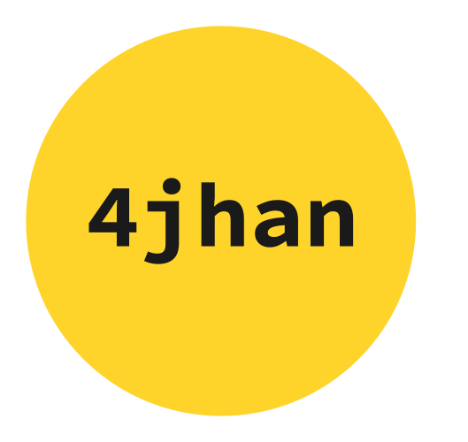

# 4jhan node.js server



**4jhan**, inspired by [4chan](http://www.4chan.org/),
is a minimal server-client network, where a board ( f.e.: `/b/`, `/g/`, `/pol/`,etc.) are hosted on individual servers.
These servers only host [JSON](http://www.json.org/) data and have to be interpreted via clients (native or web).
See [paths](/doc/PATHS.md) for specifics. By default the server will host on port 3000. If you want a different port, specify it in the `PORT` env variable.

**Feel free to [contribute](/CONTRIBUTING.md)! Possible tasks can be found in the [TODO wiki page](https://github.com/phikal/4jhan-server/wiki/TODO)**

The server is written in [node.js](http://nodejs.org/) and was tested on Linux (Fedora, Arch, Debian).
It is lightweight enough to be run on a [Raspberry Pi](http://www.raspberrypi.org/).
This is open ([MIT](/LICENSE), see `LICENSE`) and work-in-progress software, **expect errors** and keep updated.

### Setting up

After cloning the project, packages have to be installed before using from the project directory via [nmp](https://www.npmjs.com/):

```Shell
$ npm install
```

By default 4jhan will use a [SQLite](https://sqlite.org/) database, and shoud work well enough for most situations.
Data processing is done via [node-orm2](https://github.com/dresende/node-orm2/),
and therfore can also connect to [MySQL](http://www.mysql.com/) and [PostgreSQL](http://www.postgresql.org/).
How to specifically set up the connection, can be found within their [wiki page](https://github.com/dresende/node-orm2/wiki/Connecting-to-Database)

### To start server , type:

```Shell
$ ./bin/www
```

Optionally add `&` to run in background.
If you want to let it run on another computer in the background,
make sure it has [SSH](https://en.wikipedia.org/wiki/Secure_Shell) and type:

```Shell
ssh user@host -f "/path/to/www/bin"
```

It will now be running in the background.

**Note:** Don't copy directly. Duh.

**For more information (config, paths, help, h etc.), take a look at [wiki](https://github.com/phikal/4jhan-server/wiki)**
